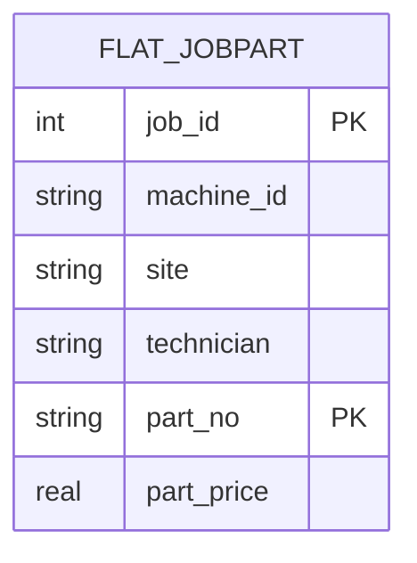
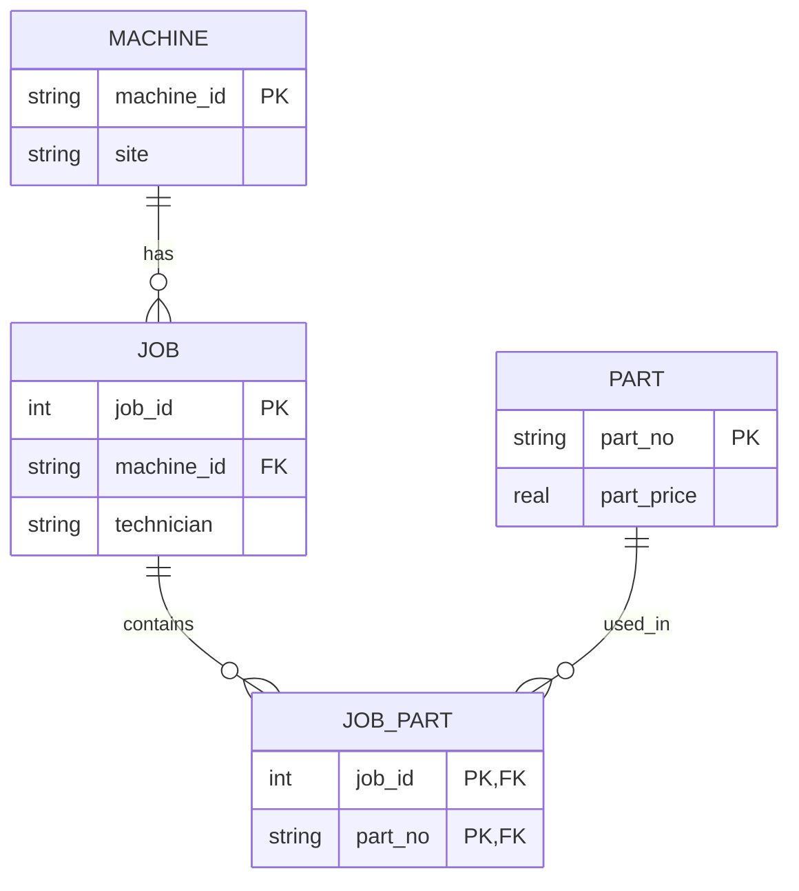

# Round 1 – ER Diagrams

## 1. Original Flat Table

```mermaid
erDiagram
    FLAT_JOBPART {
        int job_id PK
        string machine_id
        string site
        string technician
        string part_no PK
        real part_price
    }
```

## 2. Normalized Database Design

```mermaid
erDiagram
    MACHINE ||--o{ JOB : has
    JOB ||--o{ JOB_PART : contains
    PART ||--o{ JOB_PART : used_in

    MACHINE {
        string machine_id PK
        string site
    }

    JOB {
        int job_id PK
        string machine_id FK
        string technician
    }

    JOB_PART {
        int job_id PK, FK
        string part_no PK, FK
    }

    PART {
        string part_no PK
        real part_price
    }
```
